1 Задание

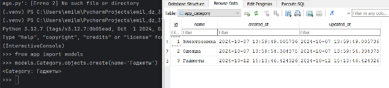

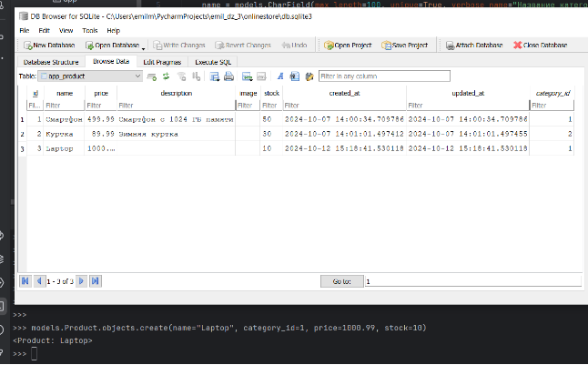

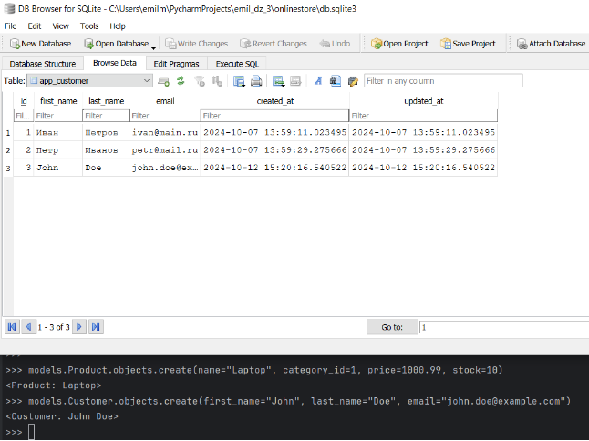

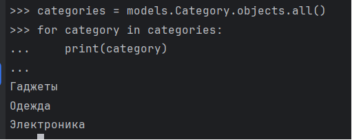

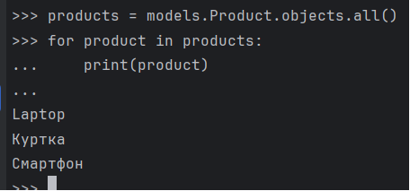

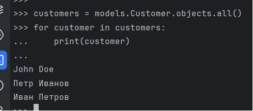

2 Задание

Filter()

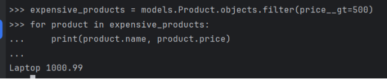

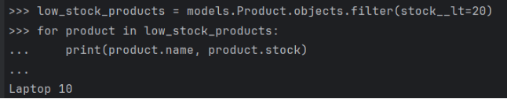

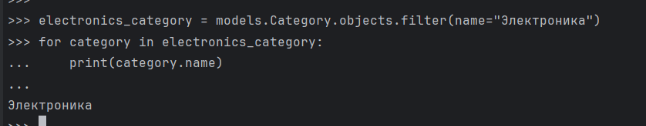

Exclude()

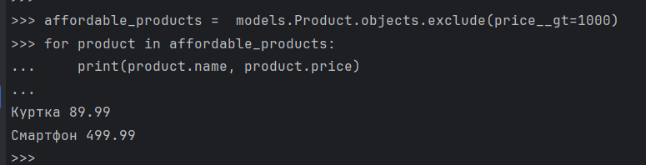

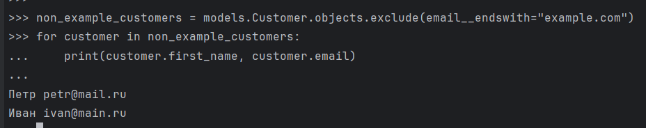

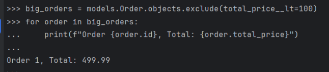

Order\_by()

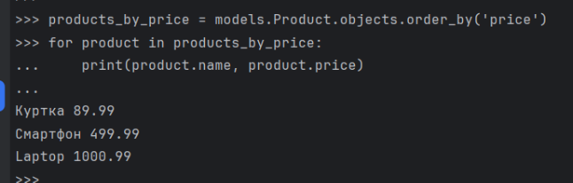

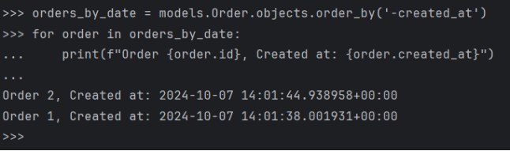

Сложный запрос

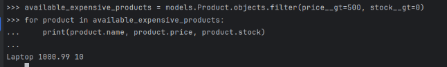

3 задание

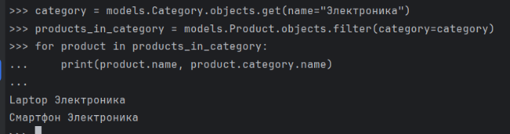

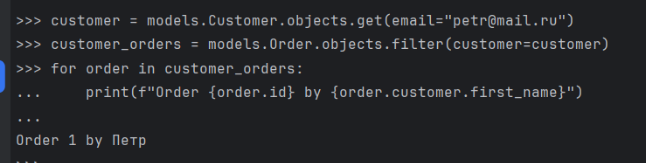

Использование values()

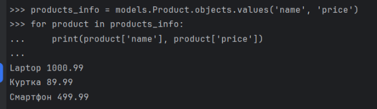

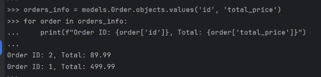

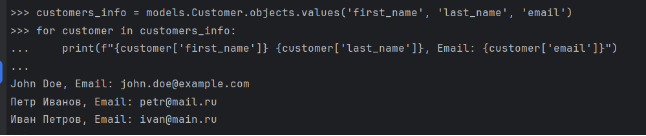

Использование values\_list()

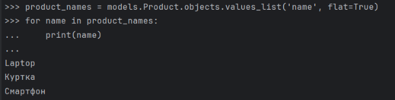

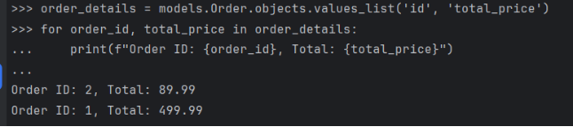

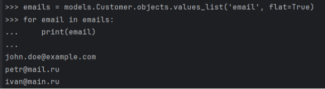

4 задание

And

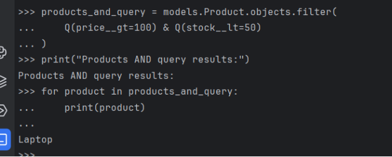

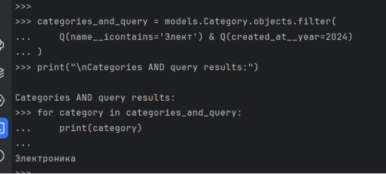

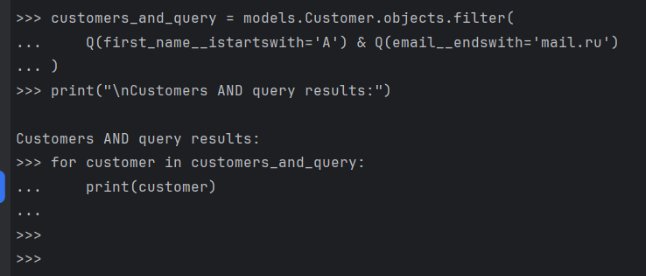

Or

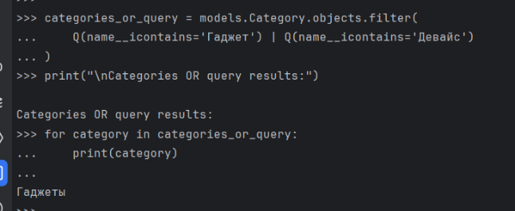

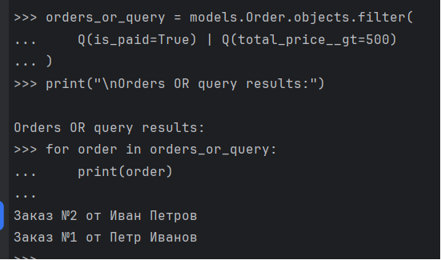

Комбинированный

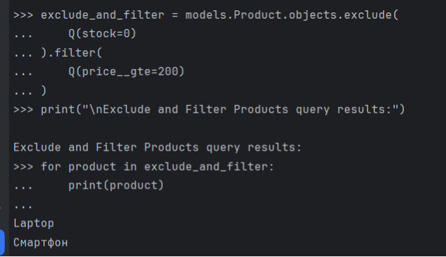

5 задание

Annotate()

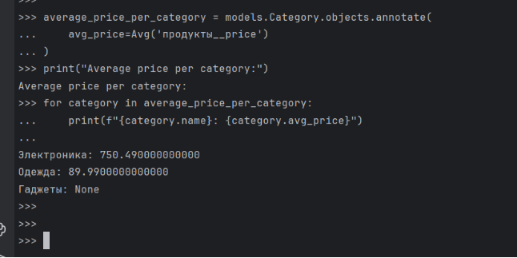

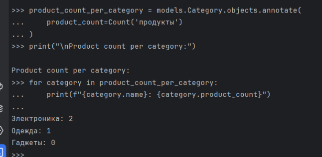

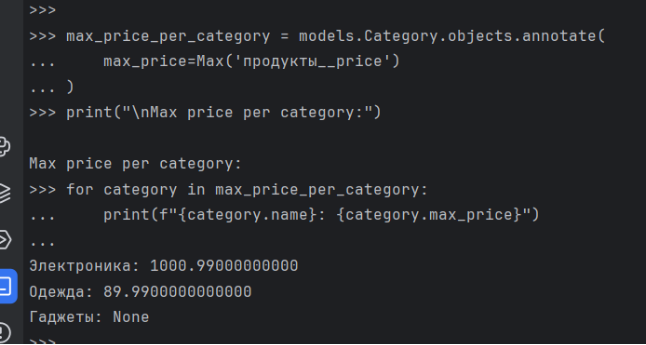

Aggregate()

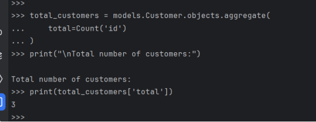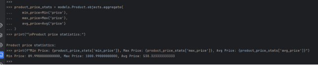

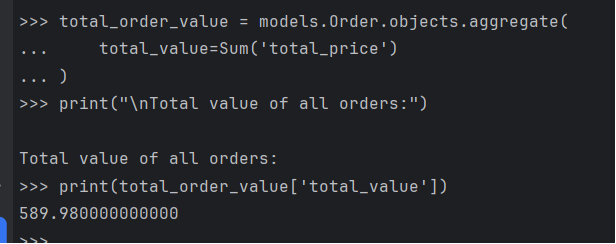

