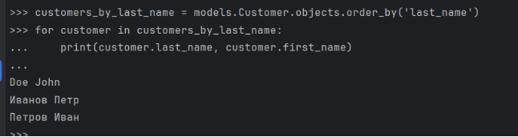
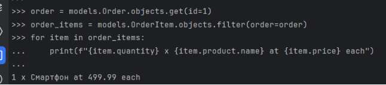
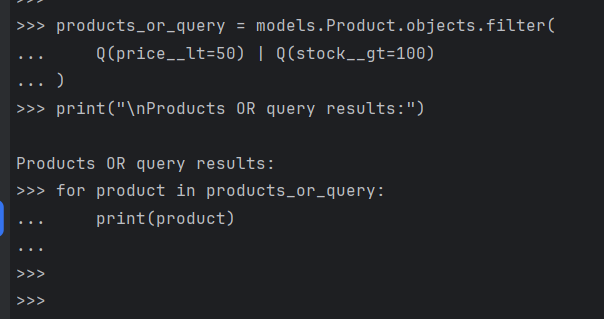

1 Задание

2 Задание

Filter()

Exclude()

Order\_by()

Сложный запрос

3 задание

Использование values()

Использование values\_list()

4 задание

And

Or

Комбинированный

5 задание

Annotate()

Aggregate()

